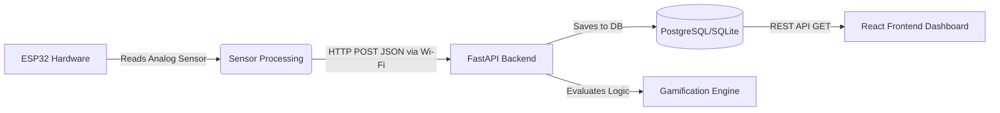

# ESP32 Smart Soil Sensor Integration for GOO Platform

## 1. Project Objective
To bridge the physical farm with the GOO digital platform by deploying low-cost **ESP32 microcontrollers** equipped with soil moisture and environment sensors. This live data will feed directly into the FastAPI backend, enabling real-time analytics, automated AI advice, and hardware-driven gamification.

---

## 2. Hardware Requirements
For a single prototype node (Cost: ~$10 - $15):
*   **Microcontroller:** ESP32 (Features built-in Wi-Fi and Bluetooth).
*   **Sensor 1:** Capacitive Soil Moisture Sensor v1.2 (Corrosion resistant).
*   **Sensor 2 (Optional):** DHT11 or DHT22 (For local air temperature and humidity).
*   **Power:** 5V Power bank or a small Solar Panel + 18650 Battery shield.
*   **Connecting:** Jumper wires.

---

## 3. Architecture & Data Flow



1. **Hardware Level:** Every 30 minutes, the ESP32 wakes up, reads the soil moisture analog value, and converts it to a percentage (0-100%).
2. **Network Level:** The ESP32 connects to the farm's Wi-Fi (or a mobile hotspot) and sends a JSON payload via an HTTP POST request to your FastAPI server.
3. **Backend Level:** FastAPI validates the API key, stores the data in the database linked to a specific `farm_profile_id`, and checks if any gamification thresholds are met.
4. **Frontend Level:** The farmer opens the GOO app, and the React frontend fetches the latest sensor data, displaying it as a dynamic health gauge.

---

## 4. Backend Implementation (FastAPI)

We will need a new database model and an endpoint to catch the data.

### Database Schema (Example conceptual logic)
```python
# app/models/sensor_data.py
class SensorData(Base):
    __tablename__ = "sensor_data"
    id = Column(Integer, primary_key=True, index=True)
    farm_profile_id = Column(Integer, ForeignKey("farm_profiles.id"))
    moisture_percent = Column(Float)
    temperature_c = Column(Float)
    timestamp = Column(DateTime, default=datetime.utcnow)
```

### FastAPI Endpoint to Catch ESP32 Data
```python
# app/api/hardware.py
from fastapi import APIRouter, Depends
from pydantic import BaseModel

router = APIRouter()

class SensorPayload(BaseModel):
    farm_profile_id: int
    moisture_percent: float
    temperature_c: float
    secret_key: str  # Basic security so random people can't POST data

@router.post("/api/hardware/telemetry")
async def receive_telemetry(data: SensorPayload):
    if data.secret_key != "YOUR_HARDWARE_SECRET":
        return {"status": "error", "message": "Unauthorized"}
        
    # 1. Save data to database here
    # save_to_db(data)
    
    # 2. Check Gamification Engine
    # if data.moisture_percent > 40 and data.moisture_percent < 60:
    #     award_points(data.farm_profile_id, 10, "Perfect Moisture Maintained")
        
    return {"status": "success", "message": "Data recorded"}
```

---

## 5. Hardware Implementation (ESP32 C++ Code)

This is a conceptual snippet of what gets flashed onto the ESP32 using the Arduino IDE.

```cpp
#include <WiFi.h>
#include <HTTPClient.h>

const char* ssid = "FARM_WIFI_NAME";
const char* password = "FARM_WIFI_PASSWORD";
const char* serverName = "http://your-fastapi-server.com/api/hardware/telemetry";

const int moisturePin = 34; // Analog pin connected to sensor

void setup() {
  Serial.begin(115200);
  WiFi.begin(ssid, password);
  while(WiFi.status() != WL_CONNECTED) {
    delay(500);
    Serial.print(".");
  }
}

void loop() {
  if(WiFi.status()== WL_CONNECTED){
    HTTPClient http;
    http.begin(serverName);
    http.addHeader("Content-Type", "application/json");
    
    // Read sensor (0-4095) and map to 0-100%
    int sensorValue = analogRead(moisturePin);
    float moisturePercent = map(sensorValue, 4095, 0, 0, 100); 
    
    // Create JSON Payload
    String httpRequestData = "{\"farm_profile_id\": 1, \"moisture_percent\": " + String(moisturePercent) + ", \"temperature_c\": 25.0, \"secret_key\": \"YOUR_HARDWARE_SECRET\"}";
    
    // Send POST
    int httpResponseCode = http.POST(httpRequestData);
    http.end();
  }
  
  // Wait 30 minutes before next reading (or use Deep Sleep for battery saving)
  delay(1800000); 
}
```

---

## 6. Synergy with GOO Features

1. **AI Assistant (`AIPage.jsx`):** Instead of the farmer typing "How is my soil?", the AI can proactively look at the database. The AI can say: *"I noticed your soil moisture dropped to 15% in Sector A today. I recommend irrigating for 2 hours this evening."*
2. **Gamification (Leaderboard):** Farmers can compete on a "Water Efficiency" leaderboard. The hardware tracks exactly how well they manage their soil moisture, awarding "Sustainability Badges" that appear on their social feed.
3. **Voice4Farmers Alerts:** If the hardware detects critical dryness, the FastAPI server can trigger an automated Twilio voice call to the farmer to warn them immediately.
