# GOO Platform: Comprehensive End-to-End System Workflow

This document provides a highly detailed, exhaustive breakdown of the GOO Platform's operational workflows. It maps out exactly how the frontend, API layer, microservices, AI engines, hardware, and database communicate in real-time.

---

## 1. Complete API Endpoint Specification (The Nervous System)

The **API Layer** acts as the central nervous system, routing requests from the React Frontend, IoT Hardware, and Voice IVR to the backend Core Services.

### A. Authentication & User Management
*   **`POST /api/auth/register`**: Receives user data -> Hashes password (`Authentication Service`) -> Creates record in MongoDB `Users` -> Returns JWT.
*   **`POST /api/auth/login`**: Validates credentials -> Returns session JWT.
*   **`GET /api/farmers/{id}/profile`**: `Farm Profile Service` fetches farm size, soil type, and location from MongoDB `FarmProfiles`.
*   **`PUT /api/farmers/{id}/profile`**: Updates farming methods and crop data.

### B. Hardware Telemetry & Environmental Data
*   **`POST /api/farm-data/telemetry`**: The ESP32 hardware sends JSON payloads (NPK, moisture, temp). This data is written to MongoDB and immediately forwarded to the `Sustainability Score Engine`.
*   **`GET /api/weather/insights`**: `Weather & Satellite Insights Engine` fetches local weather APIs and satellite crop health data, returning a unified environmental JSON object to the frontend.

### C. Gamification, Community, & Rewards
*   **`GET /api/missions/active`**: `Gamification Service` queries MongoDB `Missions` to serve daily sustainability tasks to the farmer.
*   **`POST /api/missions/complete`**: Validates mission criteria -> `Reward Engine` grants XP/Coins -> Updates MongoDB `MissionProgress` and `Rewards`.
*   **`POST /api/community/post`**: `Community Service` creates a social feed post. Triggers an async job to the `AI Sustainability Analyzer` to check if the post contains sustainable practices.
*   **`POST /api/community/interact`**: Handles likes/comments on posts.
*   **`GET /api/leaderboard/global`**: Fetches top farmers sorted by their Sustainability Score from the `Leaderboards` collection.

### D. Artificial Intelligence & Marketplace
*   **`POST /api/ai-advisor/chat`**: Routes text/audio to the LLM/RAG backend -> Queries vector database -> Returns tailored agronomist advice.
*   **`POST /api/ai-advisor/vision`**: Receives image payload -> YOLOv8 Vision AI analyzes for disease/pests -> Returns diagnosis and organic treatment recommendations.
*   **`POST /api/marketplace/list`**: `Marketplace Service` creates a product listing. Cross-references the `AI Sustainability Analyzer` to determine if the product gets an "AI-Certified Healthy" badge.
*   **`POST /api/marketplace/boost`**: Farmer spends gamification "Coins" to boost their product visibility.
*   **`POST /api/marketplace/buy`**: Processes B2C/B2B transaction -> Updates MongoDB `Orders`.

---

## 2. End-to-End Workflows (How Services Talk to Each Other)

Here is exactly how the services interact dynamically to create the closed-loop ecosystem.

### Workflow 1: The Automated Smart Farming & Gamification Loop
*How hardware triggers physical action and digital rewards.*

1.  **Hardware Trigger:** An ESP32 sensor in the field detects soil moisture has dropped to a critical 15%.
2.  **Ingestion:** The ESP32 executes `POST /api/farm-data/telemetry`.
3.  **Cross-Engine Analysis:** The API Gateway routes this to the `AI Sustainability Analyzer`. The analyzer checks the `Weather & Satellite Insights Engine` and sees no rain is forecasted for 48 hours.
4.  **Offline Notification (Voice4Farmers):** The backend triggers a Twilio Webhook. Twilio calls the farmer's feature phone. The IVR speaks in native language: *"Soil moisture is critical. Press 1 to activate smart irrigation."*
5.  **Execution:** The farmer presses '1'. Twilio sends the webhook response back to the backend. The backend sends a signal to the ESP32 to open the smart water valve.
6.  **Gamification Trigger:** The system recognizes the farmer acted promptly to save water efficiency. The `Gamification Service` is pinged.
7.  **Reward Allocation:** The `Reward Engine` allocates +50 XP and 20 Coins. It updates the `Users` and `Rewards` collections in MongoDB. The React frontend updates via WebSocket to show a "Water Saver Badge" unlocked.

### Workflow 2: From Disease Detection to Premium Marketplace Sale
*How AI computer vision directly impacts marketplace economics.*

1.  **AI Vision Request:** The farmer uploads a photo of a tomato leaf to the React Web App. The app calls `POST /api/ai-advisor/vision`.
2.  **YOLO Processing:** The YOLOv8 model scans the image and detects 0 diseases. The system logs a "Healthy Crop Event" in MongoDB `Activities`.
3.  **Marketplace Listing Intent:** Weeks later, the farmer wants to sell the harvest. They go to the Marketplace UI and submit a listing via `POST /api/marketplace/list`.
4.  **Cross-Service Validation:** The `Marketplace Service` pauses the listing creation and queries the `AI Sustainability Analyzer` and `Farm Profile Service`.
5.  **Certification Check:** The AI verifies that (A) the ESP32 sensors reported optimal watering history, and (B) the YOLO model history shows no disease.
6.  **Badge Application:** The backend automatically attaches a premium **"AI-Certified Healthy & Sustainable"** badge to the product JSON object in the `Products` collection.
7.  **Token Economy:** The farmer uses 100 "Coins" (earned from missions) to call `POST /api/marketplace/boost`, pushing their listing to the top of the app.
8.  **Purchase:** A B2B buyer (e.g., a restaurant) sees the certified badge and buys the produce at a premium price.

### Workflow 3: Social Feed to Sustainability Leaderboard
*How social interaction drives the gamification loop.*

1.  **Community Action:** A farmer implements "Crop Rotation" and posts a photo on the Social Feed (`POST /api/community/post`).
2.  **AI Interception:** Before rendering on the feed, the `Community Service` sends the post text/metadata to the `AI Sustainability Analyzer`.
3.  **NLP Verification:** The AI parses the text, recognizes "Crop Rotation" as a high-value sustainable practice, and validates the claim against satellite data.
4.  **Score Calculation:** The `Sustainability Score Engine` increases the farmer's overall sustainability rating by +5 points.
5.  **Leaderboard Shift:** The `Gamification Service` detects the score change, recalculates the global rankings, and updates the MongoDB `Leaderboards` collection.
6.  **Real-Time Frontend Update:** The React frontend fetches the new leaderboard (`GET /api/leaderboard/global`), visually moving the farmer into the "Top 10 Eco-Farmers" bracket.

---

## 3. Comprehensive Sequence Diagram (The Master Flow)

This Mermaid diagram illustrates the full lifecycle of data moving across the entire architecture.

```mermaid
sequenceDiagram
    autonumber
    
    actor Farmer (Web/Voice)
    participant ESP32 (IoT Hardware)
    participant API Gateway
    participant AI Engine Layer
    participant Gamification & Rewards
    participant Marketplace Service
    participant MongoDB (Data Layer)
    actor Buyer (Web)

    %% Scenario 1: Telemetry and Action
    rect rgb(20, 40, 20)
        Note right of ESP32: Scenario 1: IoT & Gamification Loop
        ESP32->>API Gateway: POST /api/farm-data (Low Moisture)
        API Gateway->>AI Engine Layer: Analyze Weather/Soil Data
        AI Engine Layer-->>API Gateway: No Rain. Irrigation needed.
        API Gateway->>Farmer (Web/Voice): Alert: "Water crops now?"
        Farmer (Web/Voice)->>API Gateway: Confirm Action (Yes)
        API Gateway->>ESP32: Signal: Open Valve
        API Gateway->>Gamification & Rewards: Trigger: Prompt Action Taken
        Gamification & Rewards->>MongoDB: Update XP, Coins, MissionProgress
    end

    %% Scenario 2: Disease Check
    rect rgb(20, 20, 40)
        Note right of Farmer (Web/Voice): Scenario 2: AI Health Check
        Farmer (Web/Voice)->>API Gateway: POST /api/ai-advisor/vision (Leaf Image)
        API Gateway->>AI Engine Layer: YOLOv8 Image Inference
        AI Engine Layer-->>API Gateway: Result: 100% Healthy
        API Gateway->>MongoDB: Log Health Status in Activities
    end

    %% Scenario 3: Marketplace & Economy
    rect rgb(40, 20, 20)
        Note right of Farmer (Web/Voice): Scenario 3: Certified Marketplace Sale
        Farmer (Web/Voice)->>API Gateway: POST /api/marketplace/list (Sell Tomatoes)
        API Gateway->>Marketplace Service: Create Listing Request
        Marketplace Service->>AI Engine Layer: Verify Sustainability & Health History
        AI Engine Layer-->>Marketplace Service: Verified (High Score, No Disease)
        Marketplace Service->>MongoDB: Save Product with "AI-Certified Badge"
        Farmer (Web/Voice)->>API Gateway: POST /marketplace/boost (Spend 100 Coins)
        API Gateway->>Gamification & Rewards: Deduct 100 Coins
        Gamification & Rewards->>MongoDB: Update Reward Ledger
        Marketplace Service->>MongoDB: Update Product Visibility=High
        Buyer (Web)->>API Gateway: GET /api/marketplace (Views Certified Produce)
        Buyer (Web)->>API Gateway: POST /api/marketplace/buy
        API Gateway->>MongoDB: Process Transaction & Update Orders
    end
```

