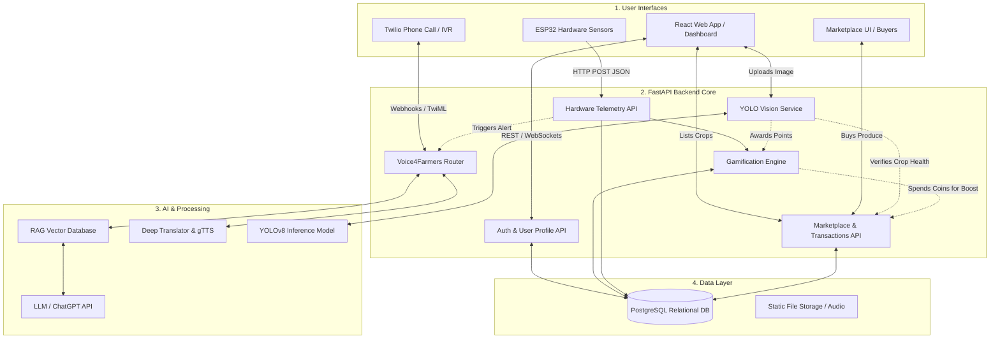

# GOO Platform: Master Architecture & Project Vision

## 1. Executive Summary
The **GOO Platform** is an end-to-end, AI-driven, gamified agritech ecosystem. It transforms traditional farming into a data-driven, socially engaging, and highly accessible practice. By merging **Social Media Gamification**, **Computer Vision (YOLO)**, **IoT Hardware (ESP32)**, **Telephony AI (Voice4Farmers)**, and a **Direct-to-Consumer Marketplace**, GOO bridges the gap between high-tech agricultural science, low-tech farming realities, and fair-trade economics.

---

## 2. The Five Pillars of the Platform (Core Modules)

### Pillar 1: The Gamified Social Network (Digital Community)
*   **Farm Profiles:** Farmers create profiles detailing their farm size, soil type, and current crops.
*   **Social Feed:** A community feed where farmers share harvests, local weather, and success stories.
*   **Gamification Engine:** Farmers earn "XP", "Coins", and "Badges" (e.g., *Master Irrigator*, *Pest Defender*) for maintaining healthy crop data, helping others on the social feed, and adopting sustainable practices.

### Pillar 2: The AI Agronomist (Computer Vision & LLM)
*   **YOLO Disease Detection:** Farmers upload photos of leaves. The YOLOv8 model instantly detects pests (e.g., locusts) or diseases (e.g., tomato blight) and recommends organic treatments.
*   **AI Chat Interface (`AIPage.jsx`):** A web-based LLM chatbot acting as a personal agronomist, capable of generating crop rotation plans, fertilizer schedules, and yield predictions.

### Pillar 3: Voice4Farmers (Offline Accessibility & IVR)
*   **Toll-Free AI Hotline:** Traditional farmers without internet access can call a Twilio-powered phone number.
*   **Multilingual Support:** The system speaks and understands Tamil, Hindi, and English.
*   **RAG Knowledge Base:** Speech is converted to text, processed through a Retrieval-Augmented Generation (RAG) database for accurate agricultural advice, and played back as native audio.

### Pillar 4: Smart Farm IoT (Hardware Telemetry)
*   **ESP32 Soil Nodes:** Low-cost, solar-powered microcontrollers placed in the field continuously monitor NPK levels, soil moisture, and temperature.
*   **Real-Time Telemetry:** Hardware sends live JSON payloads via Wi-Fi/LoRa to the FastAPI backend.
*   **Automated Action:** If soil is too dry, the system can automatically trigger smart irrigation valves.

### Pillar 5: Direct-to-Consumer Marketplace (B2B/B2C Economics)
*   **AI-Verified Produce:** Crops that were successfully monitored by the ESP32 sensors and cleared by the YOLO model get an exclusive "AI-Certified Healthy" badge on their marketplace listing.
*   **Token Economy Integration:** Farmers can use the Gamification "Coins" they earned to "Boost" their product listings to the top of the marketplace, increasing sales.
*   **Transparent Supply Chain:** Buyers (restaurants or consumers) can view a crop's timeline—seeing exactly how much water it received and its disease-free history—ensuring premium prices for high-quality farming.

---

## 3. Master System Architecture

---

## 4. Comprehensive Technology Stack

*   **Frontend (Web/Mobile-Responsive):** React.js, TailwindCSS, Vite.
*   **Backend Server:** Python, FastAPI, Uvicorn, SQLAlchemy.
*   **Database:** PostgreSQL (User data, hardware logs, marketplace listings) & ChromaDB/FAISS (RAG vector knowledge base).
*   **AI & Machine Learning:**
    *   *Vision:* Ultralytics YOLOv8 (PlantVillage dataset).
    *   *NLP/LLM:* Groq API (Llama 3) / OpenAI API.
    *   *Audio/Translation:* Twilio Voice API, Google Text-to-Speech (`gTTS`), Deep Translator.
*   **IoT/Hardware:** ESP32 Microcontrollers, Capacitive Soil Moisture Sensors, C++ (Arduino IDE), HTTPClient.
*   **Payments (Marketplace):** Stripe API or Razorpay Integration.
*   **Deployment:** Docker, Render (Backend/RAG), Vercel (Frontend), Railway (Webhooks).

---

## 5. Ecosystem Synergy (The Ultimate Use-Case)

The true power of GOO is how these 5 pillars interact autonomously. Here is the ultimate use-case scenario from Seed to Sale:

1.  **The IoT Trigger:** The ESP32 sensor detects dry soil. It sends a payload to the FastAPI backend.
2.  **The AI Analysis:** The backend notes the dryness, checks the weather API, and sees no rain is expected.
3.  **The Voice Alert:** FastAPI triggers the Twilio API to call the farmer's feature phone. The system speaks in Tamil: *"Sector 4 is critically dry. Press 1 to activate smart irrigation."*
4.  **The Action:** The farmer presses 1. Twilio sends the webhook back, and FastAPI activates the smart water valve.
5.  **The Gamification Reward:** Because the farmer resolved the issue quickly, the Gamification Engine awards them +50 XP and 100 "Coins".
6.  **The Marketplace Sale:** Harvest season arrives. The farmer lists their tomatoes on the **Marketplace**. The backend automatically applies an **"AI-Certified Healthy"** badge because the YOLO model never detected disease and the ESP32 sensors show perfect irrigation history. The farmer spends their 100 "Coins" to boost their listing, selling the tomatoes at a 20% premium directly to a local restaurant.

---

## 6. Conclusion
The GOO platform is not just an app; it is a **closed-loop agricultural operating system**. By combining the physical world (IoT), the visual world (YOLO), the offline world (Voice), the social world (Gamification), and the economic world (Marketplace), GOO provides an unprecedented, highly scalable solution to modernize farming globally and ensure farmers get paid fairly.
